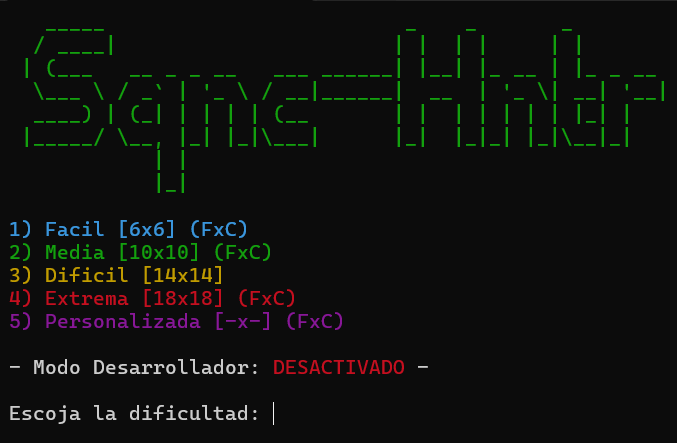
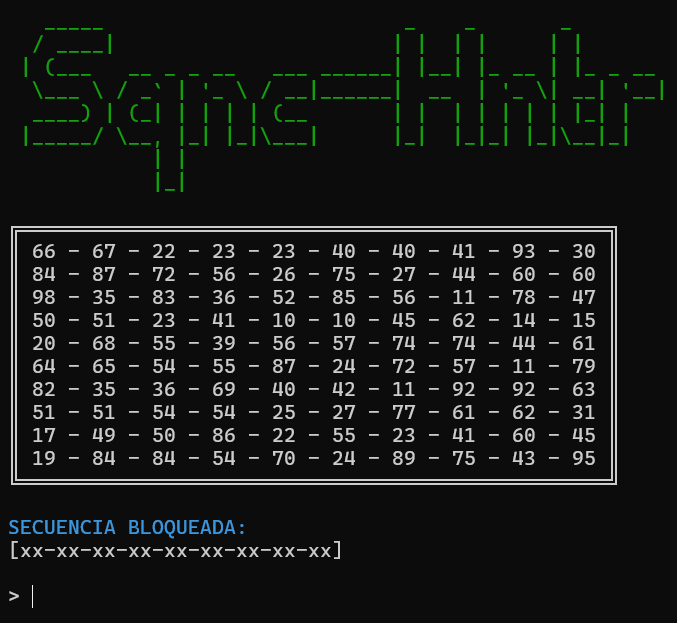

# Sequence Hunter

**"Sequence Hunter"** is a small terminal game in which you must find duplicated sequences of numbers in every set of two columns **(1-2, 2-3, 3-4 ...)** before the countdown reaches 0 in order to unlock the hidden sequence and win the game.

This minigame currently features the following:
- Colored output in every screen of the game
- Multiple languages currently available, automatically chosen:
    - English *(US)*
    - Español *(ES)*
- Round stats of each round, with unlocked sequence and time taken to complete
- Debug mode for testing purposes, with a randomly generated code on execution
    - If this mode is enabled:
      - Countdown timer will be disabled
      - Round stats won't be written

|       Game Menu       |        Minigame        |
|:---------------------:|:----------------------:|
|  |  |

*[Originally inspired by and developed for more immersion in our [F.I.S.T. TTRPG](https://www.exaltedfuneral.com/products/fist-ultra-edition) campaign]*
