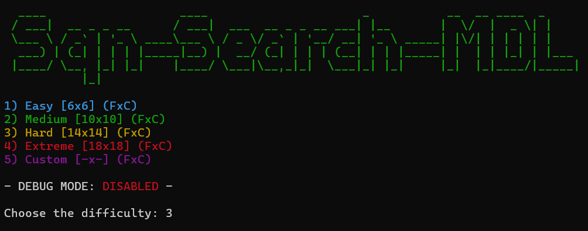
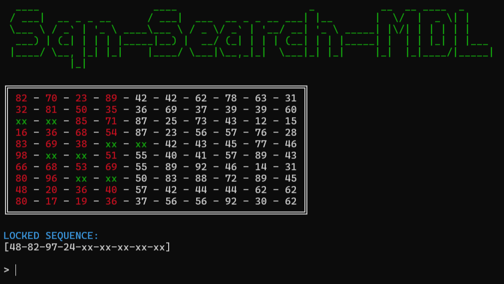

# Sequence Hunt Minigame

**"Sequence Hunt Minigame"** is a small CLI minigame built in Java in which you must find duplicated sequences of numbers **(as shown in the Minigame Table picture shown down below)** before the countdown runs out in order to unlock the hidden sequence and win the game.

This CLI minigame features the following:
- Colored text / output at all times
- Multiple languages available:
    - English
    - Español
- Round stats after each round
- Debug mode for testing purposes
    - Disables the background countdown
    - Round stats will be disabled after completion

| Difficulty Menu             |  Minigame Table |
:-------------------------:|:-------------------------:
  |  

---

Originally inspired by and developed for our [F.I.S.T](https://www.exaltedfuneral.com/products/fist-ultra-edition) TTRPG campaigns, to ensure that the character(s) with the "Hacker" trait could quickly / easily attempt to hack into various systems in the campaign, all while knowing the dangers that it could bring if they ran out of time.
